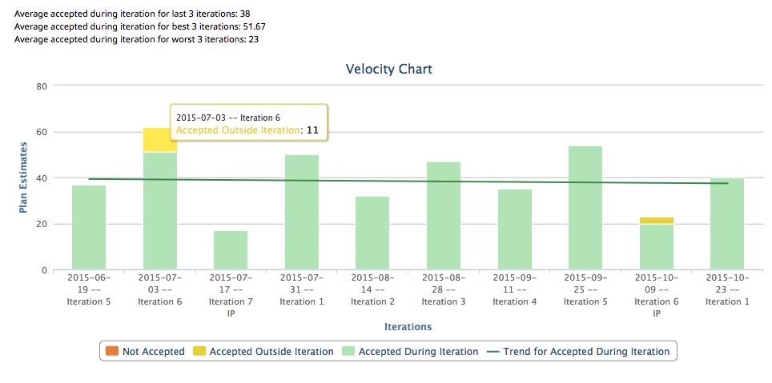

AppSDK2 Enhanced Velocity Chart 
=========================

## Overview
This is a new Enhanced Velocity Chart based on [AppSDK2](https://help.rallydev.com/apps/2.0/doc/)

It is a variation of the legacy [Enhanced Velocity Chart.](https://github.com/RallyApps/app-catalog/blob/master/src/legacy/EnhancedVelocityChartMashup.html)

A WS API endpoint scoped to a project can be used to confirm PlanEstimate values returned by the app:

https://rally1.rallydev.com/slm/webservice/v2.0/iteration?project=https://rally1.rallydev.com/slm/webservice/v2.0/project/123&query=(Name = "Your Iteration Name")&fetch=PlanEstimate

This app is vailable AS IS. It is NOT supported by Rally.
## License

AppTemplate is released under the MIT license.  See the file [LICENSE](./LICENSE) for the full text.

##Documentation for SDK

You can find the documentation on our help [site.](https://help.rallydev.com/apps/2.0/doc/)
